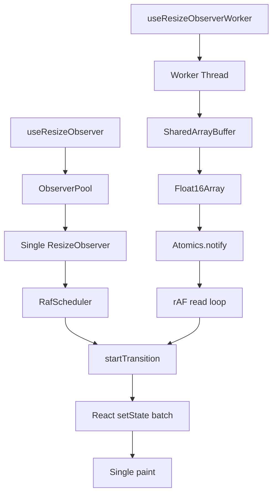

[](https://npmjs.com/package/@crimson_dev/use-resize-observer)
[](https://bundlephobia.com/package/@crimson_dev/use-resize-observer)
[](https://github.com/crimson-dev/use-resize-observer/actions/workflows/ci.yml)
[](https://codecov.io/gh/crimson-dev/use-resize-observer)
[](https://github.com/crimson-dev/use-resize-observer/blob/main/LICENSE)

<div align="center">

```
   ██████╗██████╗ ██╗███╗   ███╗███████╗ ██████╗ ███╗   ██╗
  ██╔════╝██╔══██╗██║████╗ ████║██╔════╝██╔═══██╗████╗  ██║
  ██║     ██████╔╝██║██╔████╔██║███████╗██║   ██║██╔██╗ ██║
  ██║     ██╔══██╗██║██║╚██╔╝██║╚════██║██║   ██║██║╚██╗██║
  ╚██████╗██║  ██║██║██║ ╚═╝ ██║███████║╚██████╔╝██║ ╚████║
   ╚═════╝╚═╝  ╚═╝╚═╝╚═╝     ╚═╝╚══════╝ ╚═════╝ ╚═╝  ╚═══╝
              use-resize-observer
```

**Zero-dependency, Worker-native, ESNext-first React 19 ResizeObserver hook**

</div>

## Install

```bash
npm install @crimson_dev/use-resize-observer
```

## Usage

```tsx
import { useResizeObserver } from '@crimson_dev/use-resize-observer';

const App = () => {
  const { ref, width, height } = useResizeObserver<HTMLDivElement>();
  return <div ref={ref}>{width} x {height}</div>;
};
```

## Features

| Feature | Detail |
|---------|--------|
| Bundle size | **< 300B** min+gzip |
| Dependencies | **0** runtime deps |
| React | **>= 19.3.0** with Compiler support |
| Module | **ESM-only**, `sideEffects: false` |
| TypeScript | **6.0** strict, `isolatedDeclarations` |
| Worker mode | `SharedArrayBuffer` + `Float16Array` off-main-thread |
| Box models | `content-box`, `border-box`, `device-pixel-content-box` |
| Pool | Single shared `ResizeObserver` per document root |
| Batching | `rAF` + `startTransition` = 1 render per frame |
| SSR/RSC | Server entry with mock result |
| GC cleanup | `FinalizationRegistry` for detached elements |

## Comparison with upstream

| | `use-resize-observer@9` | `@crimson_dev/use-resize-observer` |
|---|---|---|
| Bundle | ~800B | **< 300B** |
| React | 16.8+ | 19.3+ |
| Module | CJS + ESM | **ESM only** |
| TypeScript | 4.x | **6.0 strict** |
| Worker mode | No | **Yes** |
| Pool architecture | No | **Shared pool** |
| Box model options | No | **All 3** |
| React Compiler | Untested | **Verified** |
| GC cleanup | Manual | **Automatic** |

## Architecture



## Exports

```typescript
// Main — primary hook
import { useResizeObserver } from '@crimson_dev/use-resize-observer';

// Multi-element — observe N elements with 1 hook
import { useResizeObserverEntries } from '@crimson_dev/use-resize-observer';

// Factory — framework-agnostic
import { createResizeObserver } from '@crimson_dev/use-resize-observer';

// Worker — off-main-thread
import { useResizeObserverWorker } from '@crimson_dev/use-resize-observer/worker';

// Core — EventTarget-based, any framework
import { createResizeObservable } from '@crimson_dev/use-resize-observer/core';

// Server — SSR/RSC safe
import { createServerResizeObserverMock } from '@crimson_dev/use-resize-observer/server';

// Shim — polyfill for legacy browsers
import '@crimson_dev/use-resize-observer/shim';
```

## Documentation

Full documentation: [crimson-dev.github.io/use-resize-observer](https://crimson-dev.github.io/use-resize-observer/)

- [Getting Started](https://crimson-dev.github.io/use-resize-observer/guide/getting-started)
- [Architecture](https://crimson-dev.github.io/use-resize-observer/guide/architecture)
- [Worker Mode](https://crimson-dev.github.io/use-resize-observer/guide/worker)
- [API Reference](https://crimson-dev.github.io/use-resize-observer/api/)
- [Examples](https://crimson-dev.github.io/use-resize-observer/guide/examples)
- [Migration Guide](https://crimson-dev.github.io/use-resize-observer/guide/migration)

## License

[MIT](./LICENSE) - Crimson Dev
