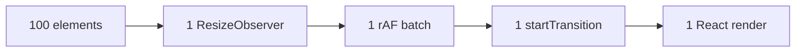

# Announcing @crimson_dev/use-resize-observer 0.9 Beta

*March 2026*

We are excited to announce the public beta of `@crimson_dev/use-resize-observer` -- a ground-up rewrite of the React ResizeObserver hook, built for the ES2026 era.

## Why a New Library?

The original `use-resize-observer` by Zsolt Pentz has been the go-to React ResizeObserver hook for years. But the React and JavaScript ecosystems have evolved dramatically:

- **React 19** introduced `startTransition`, automatic batching improvements, and the React Compiler
- **ES2026** brought `using` declarations, `Float16Array`, `Promise.try()`, and iterator helpers
- **Node 25** shipped native type stripping and full V8 13.x support
- **Workers** with `SharedArrayBuffer` are now widely supported via COOP/COEP
- **TypeScript 6** introduced `isolatedDeclarations` and `erasableSyntaxOnly`

`@crimson_dev/use-resize-observer` takes full advantage of all of these.

## What's New

### Sub-300B Bundle

The core hook compiles to less than 300 bytes min+gzip. Zero runtime dependencies. ESM-only with `sideEffects: false`. This makes it one of the smallest React hooks in the ecosystem.

| Entry Point | Min+Gzip |
|------------|----------|
| Core hook | < 300B |
| Worker addon | < 450B |
| Server entry | < 80B |
| **Total** | **< 830B** |

### Shared Observer Pool

Instead of one `ResizeObserver` per component, all observations go through a single shared instance. 100 elements resizing simultaneously produce exactly 1 React render cycle.



The pool uses a `WeakMap<Element, Set<Callback>>` to dispatch entries to the correct hook instances. When an element is garbage collected, its entry is automatically cleaned up.

### Worker Mode

Move all ResizeObserver measurement off the main thread using `SharedArrayBuffer` + `Float16Array` + `Atomics`. Zero main-thread observer callbacks:

```tsx
import { useResizeObserver } from '@crimson_dev/use-resize-observer';
import { createWorkerObserver } from '@crimson_dev/use-resize-observer/worker';

const workerObserver = createWorkerObserver({ maxElements: 256 });

const MyComponent = () => {
  const { ref, width, height } = useResizeObserver<HTMLDivElement>({
    observer: workerObserver,
  });

  return <div ref={ref}>{width} x {height}</div>;
};
```

Worker mode requires COOP/COEP headers for `SharedArrayBuffer` support. See the [Worker Mode guide](/guide/worker) for server configuration examples.

### All Three Box Models

Unlike most hooks that only support `content-box`, this library exposes all three `ResizeObserver` box models:

```tsx
// content-box (default) -- content area only
const { width } = useResizeObserver({ box: 'content-box' });

// border-box -- content + padding + border
const { width } = useResizeObserver({ box: 'border-box' });

// device-pixel-content-box -- content area in physical device pixels
const { width } = useResizeObserver({ box: 'device-pixel-content-box' });
```

### React Compiler Safe

Verified compatible with the React Compiler. The `onResize` callback uses ref-based stabilization following `useEffectEvent` semantics -- no `useCallback` needed:

```tsx
// Just pass the function. No useCallback required.
const { ref } = useResizeObserver({
  onResize: (entry) => {
    // Always has access to the latest closure values
    console.log('Count:', count);
  },
});
```

### TypeScript 6 Strict

Built with the strictest possible TypeScript configuration:

- `isolatedDeclarations` -- every export has an explicit type
- `erasableSyntaxOnly` -- no enums, no namespaces, no parameter properties
- `exactOptionalPropertyTypes` -- `undefined` is distinct from missing
- `verbatimModuleSyntax` -- imports/exports match the runtime behavior

### Framework-Agnostic Core

The `/core` entry provides an `EventTarget`-based observable for use with any framework -- Solid, Vue, Svelte, or vanilla JS:

```typescript
import { createResizeObservable } from '@crimson_dev/use-resize-observer/core';

const observable = createResizeObservable(element);
observable.addEventListener('resize', (event) => {
  const { width, height } = (event as CustomEvent).detail;
  console.log(`${width} x ${height}`);
});
```

## Try the Beta

```bash
npm install @crimson_dev/use-resize-observer@beta
```

```tsx
import { useResizeObserver } from '@crimson_dev/use-resize-observer';

const Demo = () => {
  const { ref, width, height } = useResizeObserver<HTMLDivElement>();

  return (
    <div ref={ref} style={{ resize: 'both', overflow: 'auto', padding: 24 }}>
      {width !== undefined ? `${Math.round(width)} x ${Math.round(height!)}` : 'Resize me'}
    </div>
  );
};
```

## Migration from use-resize-observer v9

For existing `use-resize-observer` users, the import change is minimal:

```diff
- import useResizeObserver from 'use-resize-observer';
+ import { useResizeObserver } from '@crimson_dev/use-resize-observer';
```

Key differences:
- Named export instead of default export
- `onResize` receives the full `ResizeObserverEntry` instead of `{ width, height }`
- Raw float values instead of rounded integers
- React 19.3+ required

See the full [Migration Guide](/guide/migration) for a step-by-step walkthrough.

## What's in the Beta

| Feature | Status |
|---------|--------|
| Core `useResizeObserver` hook | Stable |
| `useResizeObserverEntries` (multi-element) | Stable |
| `createResizeObserver` factory | Stable |
| `ResizeObserverContext` (DI) | Stable |
| Worker mode | Beta |
| Server entry (SSR/RSC) | Stable |
| Framework-agnostic `/core` entry | Beta |
| WASM rounding shim | Experimental |

## Known Limitations

### Worker mode latency

Worker mode adds 1-2 frames of measurement latency compared to main-thread mode. This is inherent to the `SharedArrayBuffer` + rAF polling architecture. For most UIs this is imperceptible, but synchronous canvas rendering may need the `onResize` callback instead.

### Safari device-pixel-content-box

Safari does not yet support `device-pixel-content-box`. The hook falls back to `content-box` values multiplied by `devicePixelRatio`, which may have sub-pixel rounding differences.

### Float16Array availability

Worker mode's `Float16Array` requires Chrome 128+ or Firefox 129+. Older browsers automatically fall back to `Float32Array`.

## Feedback

This is a beta -- we want your feedback:

- [Open issues](https://github.com/crimson-dev/use-resize-observer/issues) for bugs
- [Start discussions](https://github.com/crimson-dev/use-resize-observer/discussions) for feature requests
- Star the repo if you find it useful

## Roadmap to 1.0

The beta period will last at least 30 days. Before 1.0 we plan to:

1. Finalize the Worker mode API based on community feedback
2. Complete the benchmark suite with published baseline numbers
3. Add framework adapter packages for Vue, Solid, and Svelte
4. Publish the WASM rounding shim as stable
5. Reach 100% test coverage under React Compiler transformation
6. Validate with at least one production application

The 1.0 release criteria include all P0/P1 issues resolved, all 12 CI matrix combinations passing, and documentation fully polished.

## Thank You

Special thanks to Zsolt Pentz for the original `use-resize-observer` that inspired this project.

---

*@crimson_dev/use-resize-observer is MIT licensed and free forever.*
