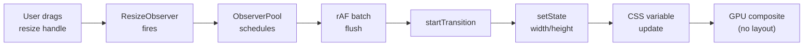

# Resize Visualizer

An annotated tour of the resize visualizer — a React reference component with a real-time bar chart, FPS counter, and dimension readouts.

## Running the Component

::: info Reference component, not a live island
VitePress renders this site with Vue, so the React visualizer is not mounted on this page. The component source is at [`docs/.vitepress/theme/components/ResizeVisualizer.tsx`](https://github.com/ABCrimson/use-resize-observer/blob/main/docs/.vitepress/theme/components/ResizeVisualizer.tsx) — drop it into any React 19.3+ project (a Vite sandbox works well) to run it. Once mounted, drag the bottom-right corner of the dashed box: the bar chart updates in real time using GPU-composited CSS `transform: scaleX()` animations.
:::

## Features Demonstrated

### GPU-Accelerated Bar Chart

The dimension bars use `transform: scaleX()` for zero-layout-cost animation. The `will-change: transform` property promotes the bars to their own compositor layer, ensuring resizes never cause layout thrashing:

```css
.resize-bar {
  will-change: transform;
  transform-origin: left;
  transform: scaleX(var(--bar-scale));
  transition: transform 0.1s ease-out;
}
```

This pattern ensures that even rapid resizing (e.g., dragging a window edge) produces smooth 60fps animations without jank.

### FPS Counter

A `requestAnimationFrame` loop counts frames per second, demonstrating that resize tracking has negligible impact on frame rate:

```tsx
const useFPS = () => {
  const [fps, setFps] = useState(0);

  useEffect(() => {
    let frameCount = 0;
    let lastTime = performance.now();
    let rafId: number;

    const tick = () => {
      frameCount++;
      const now = performance.now();
      if (now - lastTime >= 1000) {
        setFps(frameCount);
        frameCount = 0;
        lastTime = now;
      }
      rafId = requestAnimationFrame(tick);
    };

    rafId = requestAnimationFrame(tick);
    return () => cancelAnimationFrame(rafId);
  }, []);

  return fps;
};
```

### Main/Worker Toggle

The toggle button switches the visualizer's mode state, animating the panel change with the View Transitions API. Conceptually, the two modes of the library compare like this:

| Mode | What Happens |
|------|-------------|
| **Main thread** | ResizeObserver callback runs on the main thread, measurements batched via rAF |
| **Worker mode** | Main-thread ResizeObserver writes measurements to `SharedArrayBuffer`, read by rAF loop and optionally by compute workers |

Both modes produce identical visual output, but Worker mode enables zero-copy measurement sharing with compute workers (WebGL, WASM) via `SharedArrayBuffer`.

::: warning Worker mode requirements
In the current reference implementation the measurement path always runs on the main thread — the toggle demonstrates the View Transitions pattern rather than re-routing observation through the `/worker` entry. Real Worker mode additionally requires cross-origin isolation headers (COOP/COEP); see the [Worker Mode guide](/guide/worker).
:::

### View Transitions

Panel state changes (toggling between modes, expanding settings) use the [View Transitions API](https://developer.mozilla.org/en-US/docs/Web/API/View_Transitions_API) for smooth, hardware-accelerated transitions:

```tsx
const toggleMode = () => {
  if ('startViewTransition' in document) {
    document.startViewTransition(() => {
      setMode((prev) => (prev === 'main' ? 'worker' : 'main'));
    });
  } else {
    setMode((prev) => (prev === 'main' ? 'worker' : 'main'));
  }
};
```

## How It Works

When the visualizer is built on `useResizeObserver` (as in the extended example below), each resize flows through the library's full pipeline:


```mermaid
graph LR
    A["User drags\nresize handle"] --> B["ResizeObserver\nfires"]
    B --> C["ObserverPool\nschedules"]
    C --> D["rAF batch\nflush"]
    D --> E["startTransition"]
    E --> F["setState\nwidth/height"]
    F --> G["CSS variable\nupdate"]
    G --> H["GPU composite\n(no layout)"]
```

(The reference component in the theme folder uses a raw `ResizeObserver` directly so the docs theme does not need to bundle the library — the rendering techniques are identical either way.)

### Key observations

1. **Single observer** -- With the library, every `useResizeObserver` instance on the page shares one underlying `ResizeObserver` via the pool.

2. **GPU-composited bars** -- The `.resize-bar` class uses `will-change: transform` and CSS `transition` for smooth animations that run entirely on the compositor thread.

3. **rAF batching** -- Even when dragging the resize handle rapidly (producing many resize events per frame), measurements are coalesced into one update per animation frame.

4. **startTransition** -- The bar chart and dimension readouts update as a low-priority transition, so they never block user interaction with the resize handle.

## Extended Example: History Chart with ARIA

This extended variant builds the visualizer on `useResizeObserver` itself, adding a resize-history bar chart and screen-reader announcements:

```tsx
import { useResizeObserver } from '@crimson_dev/use-resize-observer';
import { useState } from 'react';

const ResizeVisualizer = () => {
  const [history, setHistory] = useState<Array<{ w: number; h: number; t: number }>>([]);

  const { ref, width, height } = useResizeObserver<HTMLDivElement>({
    onResize: (entry) => {
      const [cs] = entry.contentBoxSize;
      if (cs) {
        setHistory((prev) => [
          ...prev.slice(-19),
          { w: cs.inlineSize, h: cs.blockSize, t: Date.now() },
        ]);
      }
    },
  });

  return (
    <div>
      {/* Resizable target with ARIA live region for screen readers */}
      <div ref={ref} style={{ resize: 'both', overflow: 'auto', padding: 24 }}>
        <span aria-live="polite" aria-atomic="true" role="status">
          {width !== undefined
            ? `${Math.round(width)} × ${Math.round(height!)}`
            : 'Drag to resize'}
        </span>
      </div>

      {/* Bar chart with accessible label */}
      <div
        role="img"
        aria-label={`Resize history chart: ${history.length} measurements`}
        style={{ display: 'flex', gap: 2, alignItems: 'flex-end', height: 120 }}
      >
        {history.map((entry, i) => {
          const maxW = Math.max(...history.map((e) => e.w), 1);
          return (
            <div
              key={entry.t}
              className="resize-bar"
              aria-hidden="true"
              style={{
                flex: 1,
                height: `${(entry.w / maxW) * 100}%`,
                background: `oklch(45% 0.2 ${(i * 18) % 360})`,
                borderRadius: '2px 2px 0 0',
              }}
            />
          );
        })}
      </div>
    </div>
  );
};
```

## Accessibility

The extended example uses ARIA attributes for screen reader support:

- **`aria-live="polite"`** on the dimension readout announces size changes without interrupting the user
- **`aria-atomic="true"`** ensures the full dimension string is read, not just the changed part
- **`role="status"`** marks the readout as a live status region
- **`role="img"`** with `aria-label` on the bar chart provides a meaningful summary
- **`aria-hidden="true"`** on individual bars prevents verbose per-bar announcements

::: tip
When building resize-aware components, always wrap dynamic dimension readouts in an `aria-live` region so screen reader users are informed of size changes.
:::

## Box Model Comparison View

The visualizer can display all three box models simultaneously:

```tsx
const BoxModelVisualizer = () => {
  const ref = useRef<HTMLDivElement>(null);
  const content = useResizeObserver({ ref, box: 'content-box' });
  const border = useResizeObserver({ ref, box: 'border-box' });

  return (
    <div>
      <div ref={ref} style={{ resize: 'both', overflow: 'auto', padding: 20, border: '4px solid' }}>
        Resize me
      </div>
      <table>
        <thead><tr><th>Model</th><th>Width</th><th>Height</th></tr></thead>
        <tbody>
          <tr><td>content-box</td><td>{content.width?.toFixed(1)}</td><td>{content.height?.toFixed(1)}</td></tr>
          <tr><td>border-box</td><td>{border.width?.toFixed(1)}</td><td>{border.height?.toFixed(1)}</td></tr>
        </tbody>
      </table>
    </div>
  );
};
```

## Performance Metrics

With the Performance panel open in DevTools, you should observe:

| Metric | Expected Value |
|--------|---------------|
| Resize callbacks per frame | 1 (batched by pool) |
| React renders per frame | 1 (via startTransition) |
| Layout thrashing | None (read-only observation) |
| Paint regions | Bar chart + readout elements only |
| Compositor animations | Bar height/scale transitions |

## Try It Yourself

To browse this walkthrough locally:

```bash
git clone https://github.com/ABCrimson/use-resize-observer.git
cd use-resize-observer
npm ci
npm run docs:dev
```

Then navigate to `http://localhost:5173/use-resize-observer/demos/visualizer/`.

To run the component interactively, copy `docs/.vitepress/theme/components/ResizeVisualizer.tsx` into any React 19.3+ Vite project and render `<ResizeVisualizer />` (add the `.resize-bar` CSS from `docs/.vitepress/theme/animations.css` for the composited bar transitions).

## Source Code

The full visualizer source is at [`docs/.vitepress/theme/components/ResizeVisualizer.tsx`](https://github.com/ABCrimson/use-resize-observer/blob/main/docs/.vitepress/theme/components/ResizeVisualizer.tsx).
