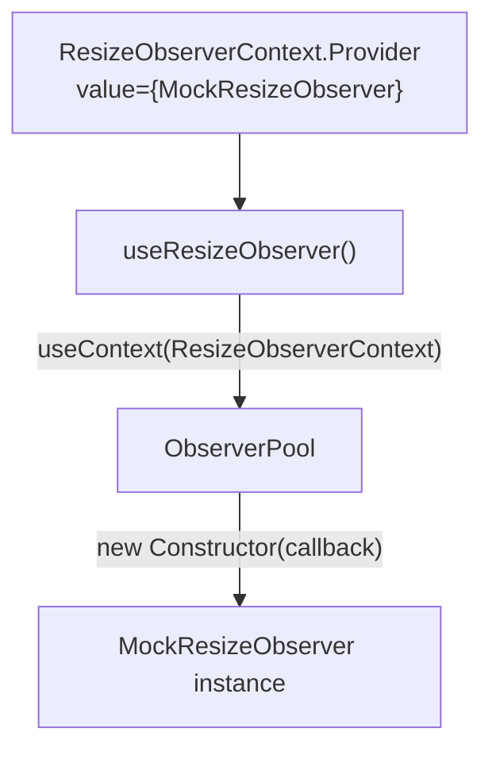

# Advanced API

Beyond the primary `useResizeObserver` hook, the library provides several advanced APIs for specialized use cases.

## `createResizeObserver` Factory

A framework-agnostic factory that uses the same shared pool as the React hook:

```typescript
import { createResizeObserver } from '@crimson_dev/use-resize-observer';

const observer = createResizeObserver({ box: 'border-box' });

observer.observe(element, (entry) => {
  console.log(entry.contentRect.width, entry.contentRect.height);
});

// Stop observing one element
observer.unobserve(element, callback);

// Disconnect all observations
observer.disconnect();
```

### Use Cases

- **Vanilla JS** applications without React
- **Web Components** that need resize tracking
- **Canvas libraries** (Three.js, PixiJS) managing their own render loop
- **Non-React frameworks** (Solid, Vue, Svelte) via the `/core` entry

### Explicit Resource Management

The factory supports ES2026 `using` declarations for automatic cleanup:

```typescript
{
  using observer = createResizeObserver({ box: 'content-box' });

  observer.observe(element, (entry) => {
    // Handle resize
  });

  // observer[Symbol.dispose]() called automatically at end of block
}
```

This is particularly useful in test setups where you want guaranteed cleanup:

```typescript
test('element resizes correctly', () => {
  using observer = createResizeObserver();
  // observer is disposed after test, even if assertions throw
});
```

## `useResizeObserverEntries` -- Multi-Element

Observe multiple elements simultaneously with a single hook call:

```tsx
import { useRef } from 'react';
import { useResizeObserverEntries } from '@crimson_dev/use-resize-observer';

const Dashboard = () => {
  const panel1 = useRef<HTMLDivElement>(null);
  const panel2 = useRef<HTMLDivElement>(null);
  const panel3 = useRef<HTMLDivElement>(null);

  const entries = useResizeObserverEntries([panel1, panel2, panel3]);

  return (
    <div className="grid">
      <div ref={panel1}>
        Panel 1: {entries.get(panel1.current!)?.width ?? 'measuring'}
      </div>
      <div ref={panel2}>
        Panel 2: {entries.get(panel2.current!)?.width ?? 'measuring'}
      </div>
      <div ref={panel3}>
        Panel 3: {entries.get(panel3.current!)?.width ?? 'measuring'}
      </div>
    </div>
  );
};
```

::: tip Performance
`useResizeObserverEntries` uses a single pool subscription for all elements -- not N separate subscriptions. This is more efficient than calling `useResizeObserver` N times when you need to track many elements from the same component.
:::

### Dynamic ref lists

The hook handles dynamic ref arrays. Elements can be added or removed between renders:

```tsx
const DynamicList = ({ items }: { items: string[] }) => {
  const refs = items.map(() => useRef<HTMLDivElement>(null));
  const entries = useResizeObserverEntries(refs);

  return (
    <div>
      {items.map((item, i) => (
        <div key={item} ref={refs[i]}>
          {item}: {entries.get(refs[i].current!)?.width ?? '...'}px
        </div>
      ))}
    </div>
  );
};
```

::: warning Rules of Hooks
The example above calls `useRef` in a loop, which works only if the list length is stable between renders. For truly dynamic lists, use a single `Map<string, RefObject>` pattern instead.
:::

## `ResizeObserverContext` -- Dependency Injection

Inject a custom `ResizeObserver` constructor for testing, SSR, or polyfill scenarios:

```tsx
import { ResizeObserverContext } from '@crimson_dev/use-resize-observer';

// Mock for tests that immediately reports a fixed size
const MockResizeObserver = class {
  constructor(private callback: ResizeObserverCallback) {}
  observe(target: Element) {
    this.callback(
      [{
        target,
        contentBoxSize: [{ inlineSize: 500, blockSize: 300 }],
        borderBoxSize: [{ inlineSize: 500, blockSize: 300 }],
        contentRect: new DOMRectReadOnly(0, 0, 500, 300),
        devicePixelContentBoxSize: [],
      } as ResizeObserverEntry],
      this as unknown as ResizeObserver,
    );
  }
  unobserve() {}
  disconnect() {}
};

const TestWrapper = ({ children }: { children: React.ReactNode }) => (
  <ResizeObserverContext.Provider value={MockResizeObserver as unknown as typeof ResizeObserver}>
    {children}
  </ResizeObserverContext.Provider>
);
```

### How the context flows



When a context value is provided, the pool uses that constructor instead of the global `ResizeObserver`. Each unique constructor gets its own pool instance to prevent cross-contamination.

## `createResizeObservable` -- Framework-Agnostic Core

The `/core` entry provides an `EventTarget`-based observable for use outside React:

```typescript
import { createResizeObservable } from '@crimson_dev/use-resize-observer/core';

const observable = createResizeObservable(element, { box: 'content-box' });

observable.addEventListener('resize', (event) => {
  const { width, height } = (event as CustomEvent).detail;
  console.log(`${width} x ${height}`);
});

// Cleanup
observable.disconnect();
```

This is the lowest-level API in the library. It provides:

- A standalone `ResizeObserver` wrapper with `EventTarget` dispatching
- `EventTarget` interface for standard event handling
- No React dependency (can be used in any JS environment)

### TypeScript types

```typescript
interface ResizeEventDetail {
  readonly width: number;
  readonly height: number;
  readonly entry: ResizeObserverEntry;
}

interface ResizeObservable extends EventTarget, Disposable {
  disconnect(): void;
}
```

## WASM Rounding (Optional)

For pixel-perfect `devicePixelContentBoxSize` normalization, an optional WASM module provides high-precision sub-pixel rounding:

```typescript
import { roundToDevicePixel } from '@crimson_dev/use-resize-observer/shim';

const cssPixels = roundToDevicePixel(199.5, window.devicePixelRatio);
// Returns the nearest CSS pixel value aligned to device pixel boundaries
```

This function accounts for the fact that `devicePixelRatio` is often an irrational number (e.g., 1.5 on 150% scaling), and naive `Math.round(value * dpr) / dpr` can produce values that don't align to actual device pixel boundaries.

::: tip When you need this
Most applications do not need device-pixel-precise rounding. This is relevant for:
- Canvas rendering where 1px misalignment causes visible blurriness
- WebGL viewports that must match the exact framebuffer size
- PDF/print rendering requiring precise pixel alignment
:::

### Fallback

If the WASM module cannot be loaded (CSP restrictions, WASM not available), it falls back to `Math.sumPrecise()` (ES2026) for the rounding calculation.

## Shadow DOM Support

The hook supports observation within Shadow DOM by scoping the pool per shadow root:

```tsx
const ShadowComponent = ({ shadowRoot }: { shadowRoot: ShadowRoot }) => {
  const { ref, width } = useResizeObserver<HTMLDivElement>({
    root: shadowRoot,
  });

  return <div ref={ref}>{width}px</div>;
};
```

Each `ShadowRoot` gets its own `ObserverPool` instance, preventing cross-contamination between shadow trees. When the shadow root is detached, its pool is automatically cleaned up via the `WeakRef` mechanism.

## API Summary

| API | Entry Point | Framework | Use Case |
|-----|------------|-----------|----------|
| `useResizeObserver` | Main | React | Standard hook |
| `useResizeObserverEntries` | Main | React | Multi-element observation |
| `createResizeObserver` | Main | Any | Factory / vanilla JS |
| `ResizeObserverContext` | Main | React | DI / testing / SSR |
| `createResizeObservable` | `/core` | Any | EventTarget-based observable |
| `createWorkerObserver` | `/worker` | Any | Off-main-thread measurements |
| `createServerResizeObserverMock` | `/server` | React | SSR/RSC mock |
| `roundToDevicePixel` | `/shim` | Any | Pixel-precise rounding |

## Next Steps

- [Examples](/guide/examples) -- Real-world usage patterns for each API
- [Worker Mode](/guide/worker) -- Deep dive on `createWorkerObserver`
- [SSR & RSC](/guide/ssr) -- Server-side usage with `ResizeObserverContext`
