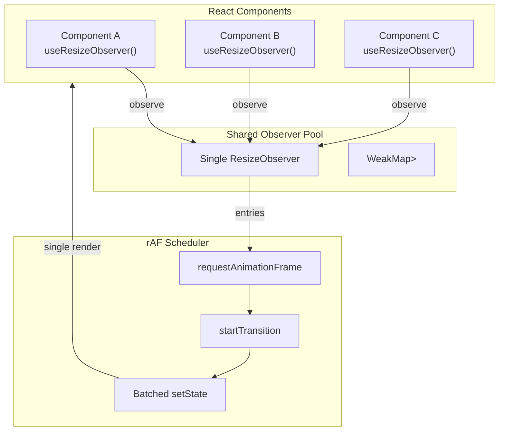
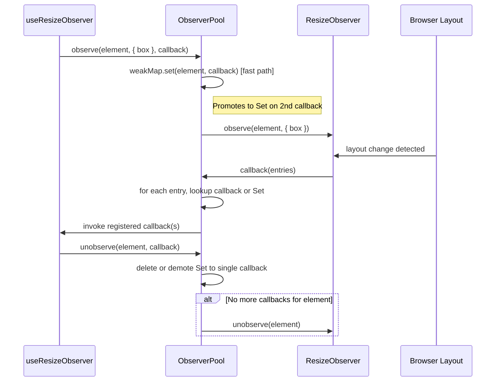
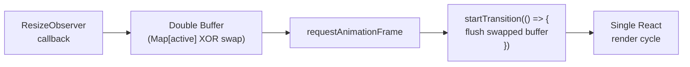
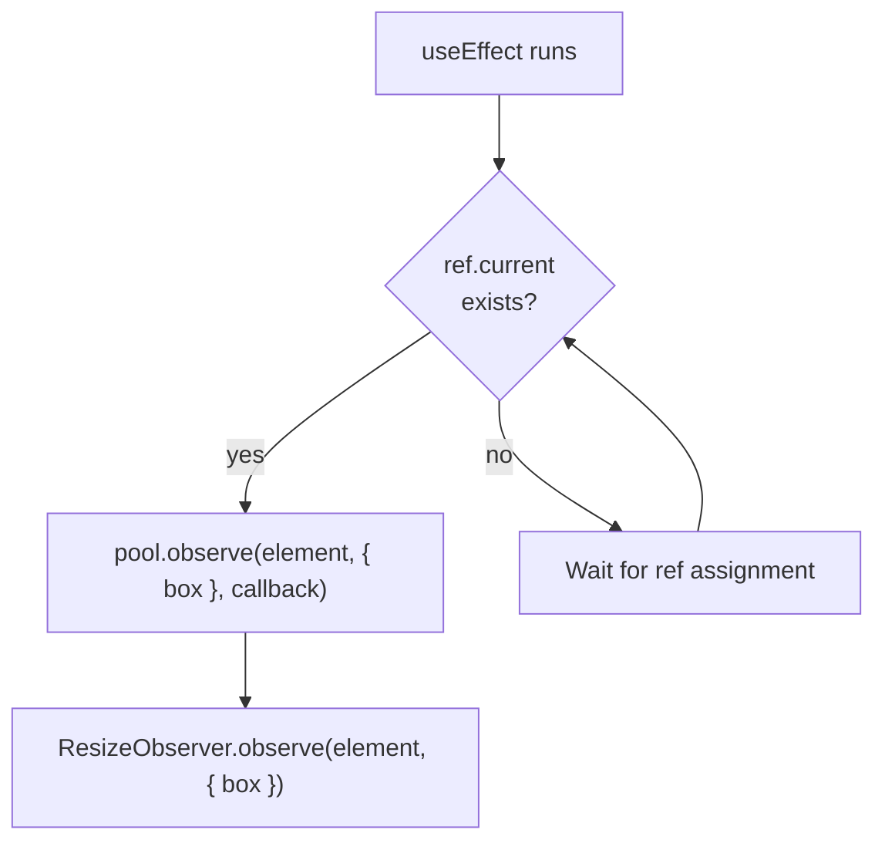
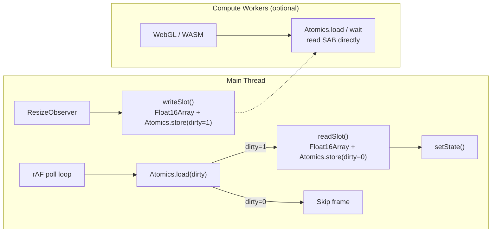

# Architecture

This page explains how `@crimson_dev/use-resize-observer` achieves single-observer pooling, rAF batching, and startTransition integration. Understanding this architecture helps you make informed decisions about performance tuning.

## High-Level Overview



## The Shared Observer Pool

Instead of creating one `ResizeObserver` per hook instance, all hook instances share a single observer through a module-level pool. This is the key architectural decision that enables scaling to hundreds of observed elements.

### How it works

1. When `useResizeObserver` mounts, it registers the target element with the pool.
2. The pool maintains a `WeakMap<Element, Callback | Set<Callback>>` — storing a single callback directly (fast path) and only promoting to a `Set` when multiple callbacks observe the same element.
3. A single `ResizeObserver` instance observes all registered elements.
4. When the observer fires, entries are dispatched to the correct callbacks via the WeakMap lookup. Single-callback entries skip Set iteration entirely.



### WeakMap cleanup

Using a `WeakMap` keyed by the DOM element ensures that when an element is garbage collected (after unmounting), its entry in the map is automatically cleaned up. No manual memory management required.

::: tip Why not one observer per box model?
The `ResizeObserver` API lets you specify the box model per `observe()` call. Elements observed with different box models can share the same observer instance. The pool handles this by including the box model in the observation options.
:::

## rAF Batching

Raw `ResizeObserver` callbacks fire synchronously during the browser's layout step, potentially multiple times per frame. Calling `setState` directly from this callback would trigger synchronous re-renders.

Instead, we defer state updates to the next `requestAnimationFrame`:



### The batching algorithm

1. When the observer fires, entries are written to the active buffer (`Map<Element, FlushEntry>`).
2. If no rAF is scheduled, one is requested.
3. On the next animation frame, the active buffer is swapped via XOR (`active ^= 1`) — zero allocation.
4. All pending entries are flushed inside a single `startTransition` call.
5. React batches all the resulting `setState` calls into one render.

The double-buffer swap means new resize events can accumulate in the fresh buffer while the previous buffer is being flushed. This eliminates per-flush `new Map()` allocation entirely.

This means that even if 100 elements resize simultaneously (e.g., during a window resize), only **one React render cycle** occurs.

## startTransition Integration

The flush is wrapped in `React.startTransition`. This marks the resize updates as non-urgent, allowing React to:

- Interrupt the resize render if a higher-priority update (like user input) arrives
- Batch the resize updates with other pending transitions
- Avoid blocking the main thread with large resize cascades

```tsx
// Internal simplified pseudocode
const flush = () => {
  const entries = drainPendingQueue();
  startTransition(() => {
    for (const [element, entry] of entries) {
      const callbacks = pool.get(element);
      callbacks?.forEach(cb => cb(entry));
    }
  });
};
```

::: warning When startTransition is not desired
If you need resize updates to be synchronous (e.g., for canvas rendering that must match exactly), use the `onResize` callback instead of the reactive `width`/`height` return values. The callback fires outside of startTransition.
:::

## Lifecycle Management

### Mount



### Unmount

Cleanup relies on the `useEffect` cleanup function. The pool's `unobserve` method decrements the callback set and, when no callbacks remain for an element, calls `ResizeObserver.unobserve`:

```tsx
// Simplified internal implementation
useEffect(() => {
  const element = ref.current;
  if (!element) return;

  const pool = getSharedPool(root ?? element.ownerDocument);
  pool.observe(element, { box }, callback);

  return () => {
    pool.unobserve(element, callback);
  };
}, [box]);
```

The cleanup function runs when the effect re-runs or the component unmounts. Additionally, `FinalizationRegistry` acts as a safety net for GC-backed cleanup if the effect cleanup is missed.

## Memory Layout

For the standard (non-worker) mode, the memory footprint per observed element is:

| Allocation | Size | Lifetime |
|-----------|------|----------|
| WeakMap entry (single callback) | ~48B | Element lifetime |
| WeakMap entry (promoted to Set) | ~96B | Element lifetime |
| Double-buffer Map entry | ~48B | Single frame |

There is no per-element `ResizeObserver` instance, no per-element closure for the observer callback, no retained `ResizeObserverEntry` objects after the flush, and no `new Map()` allocation on flush (buffers are reused via XOR swap).

## Worker Mode Architecture

Worker mode adds a `SharedArrayBuffer` layer for zero-copy data sharing. See the [Worker Mode](/guide/worker) page for the full architecture, but in brief:

ResizeObserver is a DOM API and must run on the **main thread**. Worker mode uses a main-thread observer that writes measurements directly into a `SharedArrayBuffer` via `writeSlot()`. This SAB can then be read by compute workers (WebGL, WASM) without message passing.



The `SharedArrayBuffer` (3,072 bytes) is divided into two regions: bytes 0--1023 for `Int32Array` dirty flags and bytes 1024--3071 for `Float16Array` measurement data (8 bytes per slot, 4 x Float16). The main-thread observer writes measurements and sets dirty flags via `Atomics.store()`. The rAF poll loop reads and calls `setState` only when dirty -- skipping unchanged frames entirely. Compute workers can also read the SAB directly for real-time layout data.

## Next Steps

- [Performance](/guide/performance) -- Benchmark data proving the architecture's benefits
- [Worker Mode](/guide/worker) -- Deep dive into SAB-based measurement sharing
- [Bundle Size](/guide/bundle-size) -- How tree-shaking keeps the main entry at 1.11 kB
