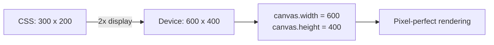

# Box Models

The `ResizeObserver` API supports three box models for measuring element dimensions. This library exposes all three through the `box` option.

## Overview

```tsx
const { ref, width, height } = useResizeObserver<HTMLDivElement>({
  box: 'content-box', // default
});
```

| Box Model | Measures | Use Case |
|-----------|----------|----------|
| `content-box` | Content area only (excludes padding, border, scrollbar) | Most UI layouts |
| `border-box` | Content + padding + border | Elements with dynamic padding |
| `device-pixel-content-box` | Content area in device pixels | Canvas, WebGL, high-DPI rendering |

## content-box (Default)

The default box model measures the content area of the element, excluding padding, borders, and scrollbars. This matches the behavior of `element.clientWidth` / `element.clientHeight` minus padding.

```tsx
import { useResizeObserver } from '@crimson_dev/use-resize-observer';

const ContentBoxExample = () => {
  const { ref, width, height } = useResizeObserver<HTMLDivElement>();
  // Equivalent to: box: 'content-box'

  return (
    <div ref={ref} style={{ padding: '20px', border: '2px solid red' }}>
      {/* width/height do NOT include the 20px padding or 2px border */}
      Content area: {width} x {height}
    </div>
  );
};
```

::: tip When to use
Use `content-box` (the default) for most layout-responsive components. It tells you how much space is available for your content, which is usually what you need for responsive breakpoint logic.
:::

## border-box

The `border-box` model includes padding and border in the measurement. This matches the behavior of `element.offsetWidth` / `element.offsetHeight`.

```tsx
const BorderBoxExample = () => {
  const { ref, width, height } = useResizeObserver<HTMLDivElement>({
    box: 'border-box',
  });

  return (
    <div ref={ref} style={{ padding: '20px', border: '2px solid red' }}>
      {/* width/height INCLUDE the 20px padding and 2px border */}
      Outer size: {width} x {height}
    </div>
  );
};
```

### When border-box matters

Border-box is useful when you need to know the total space an element occupies in the layout, for example:

- Positioning absolute/fixed overlays relative to an element's outer bounds
- Synchronizing the size of a sibling element (e.g., a shadow or highlight)
- Computing available space in a parent by subtracting children's outer sizes

## device-pixel-content-box

This box model reports the content area in **physical device pixels** rather than CSS pixels. On a 2x Retina display, a 100px CSS element reports as 200 device pixels.

```tsx
const CanvasExample = () => {
  const canvasRef = useRef<HTMLCanvasElement>(null);
  const { width, height } = useResizeObserver({
    ref: canvasRef,
    box: 'device-pixel-content-box',
  });

  useEffect(() => {
    const canvas = canvasRef.current;
    if (!canvas || width === undefined || height === undefined) return;

    // Set the canvas buffer to the exact device pixel size
    canvas.width = width;
    canvas.height = height;

    const ctx = canvas.getContext('2d');
    if (ctx) {
      ctx.scale(devicePixelRatio, devicePixelRatio);
      // Draw at native resolution...
    }
  }, [width, height]);

  return <canvas ref={canvasRef} style={{ width: '100%', height: '400px' }} />;
};
```

::: warning Browser Support
`device-pixel-content-box` is supported in Chromium 93+ and Firefox 93+. Safari does not yet support it. The hook will fall back to `contentBoxSize` values on unsupported browsers, which report CSS pixels rather than device pixels.
:::

### Why device pixels matter for canvas

When a canvas element's CSS size does not match its buffer size at the device pixel level, you get either blurry rendering (buffer too small) or wasted memory (buffer too large). The `device-pixel-content-box` model gives you the exact physical pixel dimensions, eliminating guesswork with `devicePixelRatio`.



## Combining Box Models

You can observe the same element with multiple box models by using multiple hook instances:

```tsx
const MultiBoxExample = () => {
  const ref = useRef<HTMLDivElement>(null);

  const content = useResizeObserver({ ref, box: 'content-box' });
  const border = useResizeObserver({ ref, box: 'border-box' });

  return (
    <div ref={ref} style={{ padding: '16px', border: '2px solid' }}>
      <p>Content: {content.width} x {content.height}</p>
      <p>Border: {border.width} x {border.height}</p>
      <p>Padding + Border: {
        border.width !== undefined && content.width !== undefined
          ? border.width - content.width
          : '...'
      }px horizontal</p>
    </div>
  );
};
```

Both hook instances share the same underlying `ResizeObserver` through the pool, so there is no performance penalty for observing the same element twice.

## TypeScript Types

The `box` option is typed as:

```typescript
type ResizeObserverBoxOptions = 'content-box' | 'border-box' | 'device-pixel-content-box';
```

This matches the standard `ResizeObserverOptions['box']` type from the DOM spec.

## Next Steps

- [Architecture](/guide/architecture) -- How the shared pool handles multiple box models
- [Performance](/guide/performance) -- Overhead of multi-box observation
- [Worker Mode](/guide/worker) -- Box model data in SharedArrayBuffer layout
