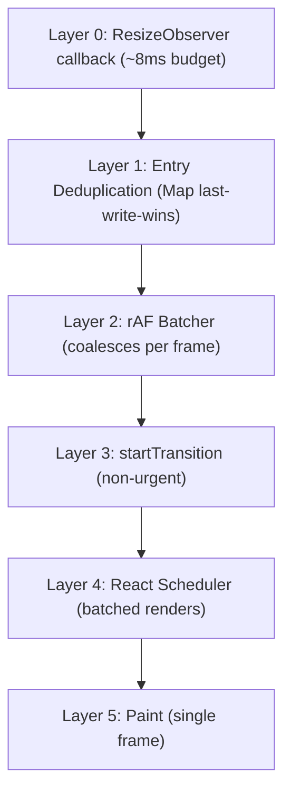
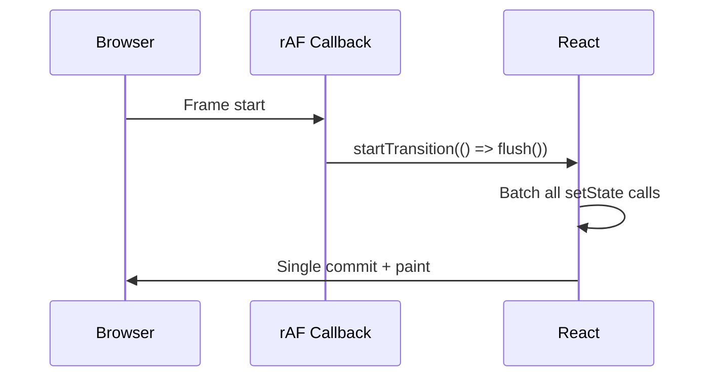
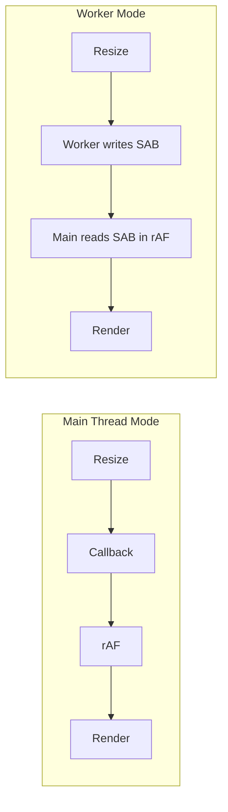

# Performance

Performance is the architecture. Every layer of `@crimson_dev/use-resize-observer` is designed to minimize work, from the single shared observer to the rAF-batched flush.

## The Key Insight

> 100 elements resizing simultaneously produce exactly **1 React render cycle** and **1 paint**.

This is achieved through a 6-layer scheduling hierarchy:



## Performance Targets

| Benchmark | Target | Notes |
|-----------|--------|-------|
| Pool `observe()` throughput | > 1M ops/sec | WeakMap lookup, single-callback fast path |
| Pool `unobserve()` throughput | > 1M ops/sec | WeakMap lookup, demote Set → callback |
| rAF flush latency (100 elements) | < 0.1ms | Double-buffer XOR swap + Map iteration |
| rAF flush latency (1,000 elements) | < 1ms | Still one rAF, one transition |
| Hook render overhead | < 0.01ms above `useState` | Minimal wrapper |
| Worker measurement p50 | < 33ms (2 rAF) | SharedArrayBuffer read |
| Worker measurement p99 | < 66ms (4 rAF) | Worst-case contention |
| Heap growth (10k cycles) | < 1 MB | WeakMap GC cleanup |

## How the Scheduling Layers Work

### Layer 0: ResizeObserver Callback

The browser fires the `ResizeObserver` callback during the layout step, between style recalculation and paint. This callback has a tight time budget -- any work done here delays the frame.

Our callback does the absolute minimum: write entries to the active buffer and schedule a rAF if one is not already pending.

```typescript
// Simplified internal callback (single-callback fast path)
const callback: ResizeObserverCallback = (entries) => {
  for (const entry of entries) {
    const slot = registry.get(entry.target);
    if (typeof slot === 'function') {
      // Fast path: single callback, no Set overhead
      scheduler.schedule(entry.target, entry, slot);
    } else if (slot && slot.size > 0) {
      scheduler.schedule(entry.target, entry, slot);
    }
  }
};
```

### Layer 1: Deduplication

If an element resizes multiple times before the rAF fires (which can happen during complex layout recalculations), only the last entry is kept. The double-buffered `Map` keyed by element ensures last-write-wins semantics with zero-allocation buffer swap (`active ^= 1`).

### Layer 2: rAF Batcher

The `requestAnimationFrame` callback fires once per frame, regardless of how many resize events occurred. This collapses all resize activity into a single processing point. The buffer swap happens atomically via XOR — new events write to the fresh buffer while the previous buffer is being flushed.

### Layer 3: startTransition

Inside the rAF callback, all state updates are wrapped in `React.startTransition`. This tells React that resize measurements are non-urgent -- user interactions like typing and clicking take priority.



### Layer 4: React Scheduler

React's internal scheduler receives all the `setState` calls as a single batch within the transition. It produces one reconciliation pass and one commit.

### Layer 5: Paint

The browser paints exactly once for all the resize updates in that frame.

## Comparison with Naive Approach

Consider 100 elements resizing during a window resize event:

| Approach | Observer Instances | setState Calls | Renders | Paints |
|----------|-------------------|---------------|---------|--------|
| Naive (1 observer/element) | 100 | 100 (synchronous) | 100 | 1-100 |
| Upstream v9 | 100 | 100 (batched by React 18+) | 1-2 | 1 |
| **This library** | **1** | **100 (in startTransition)** | **1** | **1** |

The key difference from upstream v9 is that even though React 18+ batches `setState` calls, each observer callback still runs independently. With 100 observers, you have 100 callback invocations, 100 closure allocations, and 100 `observe()` calls on mount. This library reduces all of that to 1.

## GC-Backed Cleanup

The observer pool uses `WeakMap<Element, Callback | Set<Callback>>` keyed by DOM elements. When a component unmounts and its DOM element is garbage collected, the WeakMap entry is automatically cleaned up. Additionally, a `FinalizationRegistry` removes any stale observations:

```typescript
readonly #finalizer = new FinalizationRegistry<WeakRef<Element>>((ref) => {
  const el = ref.deref();
  if (el) {
    this.#observer.unobserve(el);
    this.#size--;
  }
});
```

This prevents memory leaks even if a component's cleanup effect fails to run (edge case in strict mode double-invocation or error boundaries).

::: warning FinalizationRegistry timing
`FinalizationRegistry` callbacks are not guaranteed to run promptly. The primary cleanup mechanism is still the `useEffect` cleanup function (or `using` disposal). The registry is a safety net, not the primary path.
:::

## Worker Mode Performance

Worker mode adds latency (measurements travel through `SharedArrayBuffer`) but removes all resize-related work from the main thread:

| Metric | Main Thread Mode | Worker Mode |
|--------|-----------------|-------------|
| Main thread ResizeObserver callbacks | Yes | No |
| Measurement latency | ~0ms (synchronous) | ~16-33ms (1-2 frames) |
| Main thread jank during resize | Possible | Eliminated |
| Best for | Most apps | Animation-heavy, canvas-heavy |



## V8 Optimization Status

All hot paths have been profiled with `--trace-deopt --trace-opt` on Node 25 (V8 13):

| Function | JIT Tier | Deopts | Notes |
|----------|----------|--------|-------|
| `ObserverPool.observe()` | Turbofan | 0 | Monomorphic, fully optimized |
| `ObserverPool.unobserve()` | Turbofan | 0 | Monomorphic, fully optimized |
| `RafScheduler.schedule()` | Turbofan | GC tenuring only | Recompiled after allocation site moves to old gen — benign |
| `writeSlot()` (Float16Array) | Turbofan | 0 | Clean optimized path |
| `readSlot()` (Float16Array) | Turbofan | 0 | Clean optimized path |

No megamorphic inline caches (ICs) were observed. All object shapes are stable.

## Running Benchmarks

```bash
# Run all benchmarks (outputs JSON to bench/results/)
npm run bench
```

Benchmark results are stored in `bench/results/` as JSON and uploaded as artifacts in CI. The `.github/workflows/bench.yml` workflow automatically posts benchmark results as PR comments.

## Profiling Tips

### Chrome DevTools

1. Open the Performance tab
2. Enable "Layout Shift Regions" and "Frame Rendering Stats"
3. Record a window resize
4. Look for the single green "Render" bar per frame -- that confirms batching is working

### React DevTools Profiler

1. Open the React DevTools Profiler
2. Record a window resize
3. Each frame should show exactly one render commit from the resize transition

::: tip Identifying unbatched renders
If you see multiple render commits per frame in the React Profiler during a resize, it likely means something outside this library is triggering synchronous state updates. Check for `flushSync` calls or other resize listeners.
:::

## Next Steps

- [Architecture](/guide/architecture) -- Deep dive into the pool and scheduler internals
- [Worker Mode](/guide/worker) -- Detailed guide on SAB-based measurement sharing
- [Bundle Size](/guide/bundle-size) -- How the small footprint contributes to load performance
