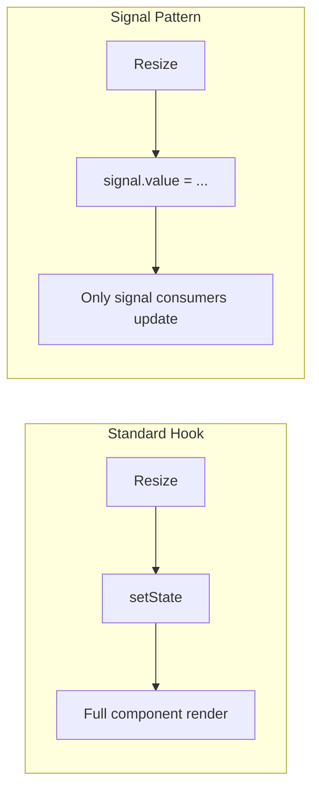

# Signals Integration

`@crimson_dev/use-resize-observer` integrates with reactive signal libraries for fine-grained reactivity, avoiding full component re-renders when dimensions change.

## Why Signals?

With the standard hook API, every dimension change triggers a component re-render via `setState`. For most components this is fine, but in performance-critical scenarios (large lists, complex charts, animation-driven UIs), you may want only the specific DOM nodes that display the dimensions to update.

Signals provide exactly this: fine-grained reactivity that bypasses React's component-level rendering.



## Preact Signals

[`@preact/signals-react`](https://github.com/preactjs/signals) integrates directly with React, allowing signals to update DOM text nodes without triggering component renders.

```tsx
import { signal } from '@preact/signals-react';
import { useResizeObserver } from '@crimson_dev/use-resize-observer';

const widthSignal = signal<number | undefined>(undefined);
const heightSignal = signal<number | undefined>(undefined);

const ResponsiveComponent = () => {
  const { ref } = useResizeObserver<HTMLDivElement>({
    onResize: (entry) => {
      const [cs] = entry.contentBoxSize;
      widthSignal.value = cs?.inlineSize;
      heightSignal.value = cs?.blockSize;
    },
  });

  return (
    <div ref={ref}>
      {/* Only this span re-renders when dimensions change */}
      <span>{widthSignal} x {heightSignal}</span>
    </div>
  );
};
```

::: tip Zero component re-renders
In this pattern, the component function itself never re-runs after mount. The `onResize` callback writes to signals, and only the `<span>` text nodes update. The parent `<div>` and all sibling elements are untouched.
:::

### Computed values with signals

You can derive computed values from the dimension signals:

```tsx
import { signal, computed } from '@preact/signals-react';

const width = signal<number>(0);
const height = signal<number>(0);

const aspectRatio = computed(() =>
  height.value > 0 ? width.value / height.value : 1
);

const isWide = computed(() => width.value > 768);

const Layout = () => {
  const { ref } = useResizeObserver<HTMLDivElement>({
    onResize: (entry) => {
      const [cs] = entry.contentBoxSize;
      width.value = cs?.inlineSize ?? 0;
      height.value = cs?.blockSize ?? 0;
    },
  });

  return (
    <div ref={ref}>
      <p>Aspect ratio: {aspectRatio}</p>
      <p>Layout: {isWide.value ? 'Desktop' : 'Mobile'}</p>
    </div>
  );
};
```

## @reactively/core

[Reactively](https://github.com/modderme123/reactively) provides a lightweight reactive primitive that works with any framework:

```tsx
import { reactive } from '@reactively/core';
import { useResizeObserver } from '@crimson_dev/use-resize-observer';

const dimensions = reactive({ width: 0, height: 0 });

const ReactiveComponent = () => {
  const { ref } = useResizeObserver<HTMLDivElement>({
    onResize: (entry) => {
      const [cs] = entry.contentBoxSize;
      dimensions.width = cs?.inlineSize ?? 0;
      dimensions.height = cs?.blockSize ?? 0;
    },
  });

  return <div ref={ref}>{dimensions.width} x {dimensions.height}</div>;
};
```

## Legend State

[Legend State](https://legendapp.com/open-source/state/) provides observable-based reactivity:

```tsx
import { observable } from '@legendapp/state';
import { observer } from '@legendapp/state/react';
import { useResizeObserver } from '@crimson_dev/use-resize-observer';

const size$ = observable({ width: 0, height: 0 });

const ObservedComponent = observer(() => {
  const { ref } = useResizeObserver<HTMLDivElement>({
    onResize: (entry) => {
      const [cs] = entry.contentBoxSize;
      size$.set({
        width: cs?.inlineSize ?? 0,
        height: cs?.blockSize ?? 0,
      });
    },
  });

  return (
    <div ref={ref}>
      {size$.width.get()} x {size$.height.get()}
    </div>
  );
});
```

## Framework-Agnostic Core with Signals

For non-React contexts, use the `/core` entry with any signal library:

```typescript
import { createResizeObservable } from '@crimson_dev/use-resize-observer/core';
import { signal } from '@preact/signals';

const element = document.getElementById('target')!;
const observable = createResizeObservable(element);

const width = signal(0);
const height = signal(0);

observable.addEventListener('resize', (event) => {
  const detail = (event as CustomEvent).detail;
  width.value = detail.width;
  height.value = detail.height;
});
```

## Solid.js Integration

```typescript
import { createSignal, onCleanup } from 'solid-js';
import { createResizeObservable } from '@crimson_dev/use-resize-observer/core';

function useResizeObserver(el: () => Element) {
  const [width, setWidth] = createSignal(0);
  const [height, setHeight] = createSignal(0);

  const observable = createResizeObservable(el());

  observable.addEventListener('resize', (event) => {
    const detail = (event as CustomEvent).detail;
    setWidth(detail.width);
    setHeight(detail.height);
  });

  onCleanup(() => observable.disconnect());

  return { width, height };
}
```

## Svelte 5 Runes Integration

```svelte
<script lang="ts">
  import { createResizeObservable } from '@crimson_dev/use-resize-observer/core';

  let container: HTMLDivElement;
  let width = $state(0);
  let height = $state(0);

  $effect(() => {
    if (!container) return;
    const observable = createResizeObservable(container);
    observable.addEventListener('resize', (event) => {
      const detail = (event as CustomEvent).detail;
      width = detail.width;
      height = detail.height;
    });
    return () => observable.disconnect();
  });
</script>

<div bind:this={container}>
  {width} x {height}
</div>
```

## Compiler Compatibility

All signal patterns above are verified compatible with the React Compiler. The key reason: the `onResize` callback is ref-stabilized internally, so signal writes always reference the current signal instance without needing `useCallback`.

::: warning Signal library compatibility
Ensure your signal library is itself compatible with the React Compiler. `@preact/signals-react` v2+ and Legend State v3+ are verified compatible. Check your library's documentation for compiler support status.
:::

## Performance Comparison

| Pattern | Renders on Resize | DOM Updates | Memory |
|---------|------------------|-------------|--------|
| Standard `useState` | Full component | Full subtree | Lowest |
| Preact Signals | None (signal subscriber only) | Text nodes only | Low |
| Reactively | None (reactive consumer only) | Targeted | Low |
| Legend State | None (observer boundary only) | Observer subtree | Low |

## Next Steps

- [React Compiler](/guide/compiler) -- How the compiler interacts with signal patterns
- [Advanced API](/guide/advanced) -- The `/core` entry used for framework-agnostic signal integration
- [Performance](/guide/performance) -- Measuring signal vs useState performance
