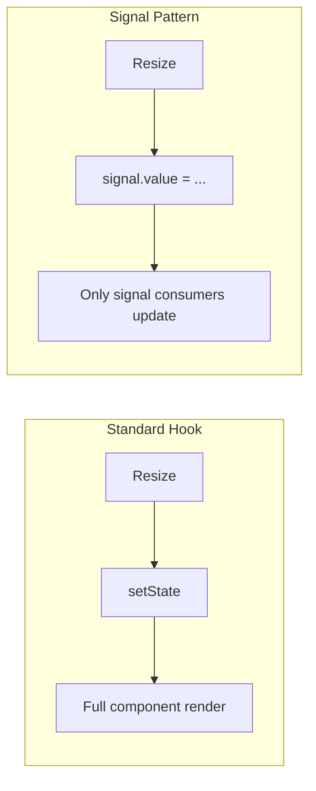

# Signals Integration

`@crimson_dev/use-resize-observer` integrates with reactive signal libraries for fine-grained reactivity, avoiding full component re-renders when dimensions change.

## Why Signals?

With the standard hook API, every dimension change triggers a component re-render via `setState`. For most components this is fine, but in performance-critical scenarios (large lists, complex charts, animation-driven UIs), you may want only the specific DOM nodes that display the dimensions to update.

Signals provide exactly this: fine-grained reactivity that bypasses React's component-level rendering.


```mermaid
flowchart LR
    subgraph Standard["Standard Hook"]
        A["Resize"] --> B["setState"] --> C["Full component render"]
    end

    subgraph Signals["Signal Pattern"]
        D["Resize"] --> E["signal.value = ..."] --> F["Only signal consumers update"]
    end
```

## Preact Signals

[`@preact/signals-react`](https://github.com/preactjs/signals) integrates directly with React, allowing signals to update DOM text nodes without triggering component renders.

```tsx
import { signal } from '@preact/signals-react';
import { useResizeObserver } from '@crimson_dev/use-resize-observer';

const widthSignal = signal<number | undefined>(undefined);
const heightSignal = signal<number | undefined>(undefined);

const ResponsiveComponent = () => {
  const { ref } = useResizeObserver<HTMLDivElement>({
    onResize: (entry) => {
      const [cs] = entry.contentBoxSize;
      widthSignal.value = cs?.inlineSize;
      heightSignal.value = cs?.blockSize;
    },
  });

  return (
    <div ref={ref}>
      {/* Only this span re-renders when dimensions change */}
      <span>{widthSignal} x {heightSignal}</span>
    </div>
  );
};
```

::: tip Zero component re-renders
In this pattern, the component function itself never re-runs after mount. The `onResize` callback writes to signals, and only the `<span>` text nodes update. The parent `<div>` and all sibling elements are untouched.
:::

### Computed values with signals

You can derive computed values from the dimension signals:

```tsx
import { signal, computed } from '@preact/signals-react';

const width = signal<number>(0);
const height = signal<number>(0);

const aspectRatio = computed(() =>
  height.value > 0 ? width.value / height.value : 1
);

const isWide = computed(() => width.value > 768);

const Layout = () => {
  const { ref } = useResizeObserver<HTMLDivElement>({
    onResize: (entry) => {
      const [cs] = entry.contentBoxSize;
      width.value = cs?.inlineSize ?? 0;
      height.value = cs?.blockSize ?? 0;
    },
  });

  return (
    <div ref={ref}>
      <p>Aspect ratio: {aspectRatio}</p>
      <p>Layout: {isWide.value ? 'Desktop' : 'Mobile'}</p>
    </div>
  );
};
```

## @reactively/core

[Reactively](https://github.com/modderme123/reactively) provides a lightweight reactive primitive that works with any framework:

```tsx
import { reactive } from '@reactively/core';
import { useResizeObserver } from '@crimson_dev/use-resize-observer';

const dimensions = reactive({ width: 0, height: 0 });

const ReactiveComponent = () => {
  const { ref } = useResizeObserver<HTMLDivElement>({
    onResize: (entry) => {
      const [cs] = entry.contentBoxSize;
      dimensions.width = cs?.inlineSize ?? 0;
      dimensions.height = cs?.blockSize ?? 0;
    },
  });

  return <div ref={ref}>{dimensions.width} x {dimensions.height}</div>;
};
```

## Legend State

[Legend State](https://legendapp.com/open-source/state/) provides observable-based reactivity:

```tsx
import { observable } from '@legendapp/state';
import { observer } from '@legendapp/state/react';
import { useResizeObserver } from '@crimson_dev/use-resize-observer';

const size$ = observable({ width: 0, height: 0 });

const ObservedComponent = observer(() => {
  const { ref } = useResizeObserver<HTMLDivElement>({
    onResize: (entry) => {
      const [cs] = entry.contentBoxSize;
      size$.set({
        width: cs?.inlineSize ?? 0,
        height: cs?.blockSize ?? 0,
      });
    },
  });

  return (
    <div ref={ref}>
      {size$.width.get()} x {size$.height.get()}
    </div>
  );
});
```

## Framework-Agnostic Core with Signals

For non-React contexts, use the `/core` entry with any signal library:

```typescript
import {
  createResizeObservable,
  type ResizeEventDetail,
} from '@crimson_dev/use-resize-observer/core';
import { signal } from '@preact/signals';

const element = document.getElementById('target')!;
const observable = createResizeObservable(element);

const width = signal(0);
const height = signal(0);

observable.addEventListener('resize', (event) => {
  const { width: w, height: h } = (event as CustomEvent<ResizeEventDetail>).detail;
  width.value = w;
  height.value = h;
});

// When you are done:
observable.disconnect();
```

The `/core` entry exports the event shape so you do not have to hand-type `detail`:

| Export | Kind | Shape |
|--------|------|-------|
| `createResizeObservable(target, options?)` | function | Returns a `ResizeObservable` |
| `ResizeObservable` | interface | `EventTarget & Disposable` plus `disconnect()` |
| `ResizeEvent` | class | `CustomEvent<ResizeEventDetail>`, type `'resize'` |
| `ResizeEventDetail` | interface | `{ width: number; height: number; entry: ResizeObserverEntry }` |

Because `ResizeObservable` implements `Disposable`, an ES2026 `using` declaration disposes it at scope exit — no manual `disconnect()`:

```typescript
{
  using observable = createResizeObservable(element);
  observable.addEventListener('resize', handler);
} // disconnected here
```

> [!IMPORTANT]
> **`/core` is not pooled.** `createResizeObservable` constructs its own native `ResizeObserver` per call. The shared-pool architecture backs the React hooks and the `createResizeObserver` factory on the main entry — not this one. For a handful of observables that is fine; if you are creating hundreds, reach for `createResizeObserver` from the main entry instead, which multiplexes them through one observer per document root.

## Solid.js Integration

```typescript
import { createSignal, onCleanup } from 'solid-js';
import {
  createResizeObservable,
  type ResizeEventDetail,
} from '@crimson_dev/use-resize-observer/core';

function useResizeObserver(el: () => Element) {
  const [width, setWidth] = createSignal(0);
  const [height, setHeight] = createSignal(0);

  const observable = createResizeObservable(el());

  observable.addEventListener('resize', (event) => {
    const detail = (event as CustomEvent<ResizeEventDetail>).detail;
    setWidth(detail.width);
    setHeight(detail.height);
  });

  onCleanup(() => observable.disconnect());

  return { width, height };
}
```

## Svelte 5 Runes Integration

```svelte
<script lang="ts">
  import {
    createResizeObservable,
    type ResizeEventDetail,
  } from '@crimson_dev/use-resize-observer/core';

  let container: HTMLDivElement;
  let width = $state(0);
  let height = $state(0);

  $effect(() => {
    if (!container) return;
    const observable = createResizeObservable(container);
    observable.addEventListener('resize', (event) => {
      const detail = (event as CustomEvent<ResizeEventDetail>).detail;
      width = detail.width;
      height = detail.height;
    });
    return () => observable.disconnect();
  });
</script>

<div bind:this={container}>
  {width} x {height}
</div>
```

## Compiler Compatibility

The half of this that **this library** guarantees: `onResize` is ref-stabilized internally (`hook.ts` writes `onResizeRef.current` on every render and calls it through the ref), so its identity never changes and the React Compiler has nothing to invalidate. You never need `useCallback` around a signal write. That behaviour is covered by the `compiler` test project, which runs the hook suite through `babel-plugin-react-compiler`.

The half it **cannot** guarantee: whether your signal library is itself compiler-safe.

> [!WARNING]
> No third-party signal library is exercised by this repository's test suite — the `compiler` project tests the hook, not `@preact/signals-react`, Reactively, or Legend State. The patterns on this page follow each library's documented usage, but treat compiler compatibility as something to confirm against your library's own release notes and to verify in your app.

## Update Scope by Pattern

What each pattern re-runs when the observed element resizes. This is mechanism, not a benchmark — measure your own app before switching.

| Pattern | Component re-render | DOM updated | Extra dependency |
|---------|--------------------|-------------|------------------|
| Standard `useState` | Yes — the component and its subtree reconcile | Whatever reconciliation changes | None |
| Preact Signals | No — the component body does not re-run | The subscribing text nodes | `@preact/signals-react` |
| Reactively | No | Whatever the reactive consumer touches | `@reactively/core` |
| Legend State | No | Inside the `observer()` boundary | `@legendapp/state` |

> [!NOTE]
> The standard hook is already batched: the pool coalesces every resize in a frame into a single `requestAnimationFrame` flush wrapped in `startTransition`, so 100 elements resizing at once produce one render pass. Signals reduce the *scope* of that pass, not the number of passes. Reach for them when the component subtree is genuinely expensive, not by default.

## Next Steps

- [React Compiler](/guide/compiler) -- How the compiler interacts with signal patterns
- [Advanced API](/guide/advanced) -- The `/core` entry used for framework-agnostic signal integration
- [Performance](/guide/performance) -- Measuring signal vs useState performance
