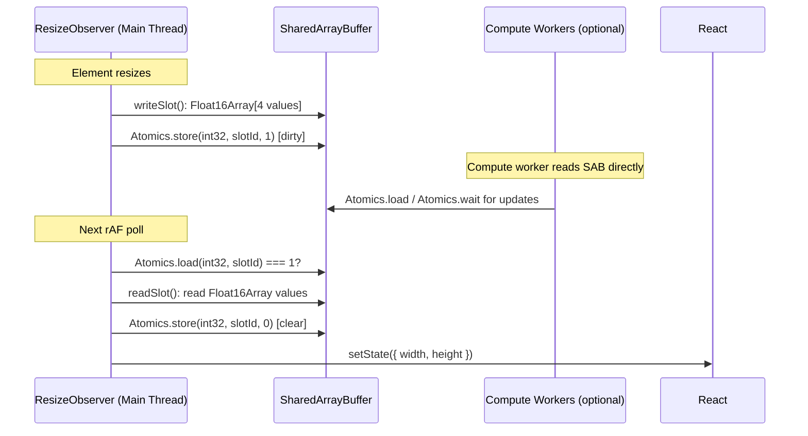
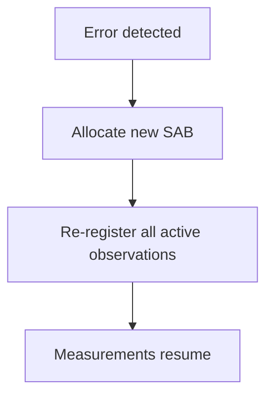

# Worker Mode

Share live ResizeObserver measurements with compute workers (WebGL, WASM) for jank-free UIs using `SharedArrayBuffer` and `Float16Array`.

## When to Use Worker Mode

Worker mode is beneficial when:

- You need to **share live measurements with compute workers** (WebGL renderers, WASM pipelines)
- Resize callbacks trigger **expensive computations** that you want to offload to a Worker
- You need **zero-copy data sharing** between the main thread and background threads
- Your app uses **SharedArrayBuffer** for other performance-critical data flows

::: tip Decision Rule
If your app has fewer than 50 observed elements and no animation during resize, the main-thread hook is sufficient and simpler.
:::

## Quick Start

```tsx
import { useResizeObserverWorker } from '@crimson_dev/use-resize-observer/worker';

const MyComponent = () => {
  const { ref, width, height } = useResizeObserverWorker<HTMLDivElement>({
    box: 'content-box',
  });

  return <div ref={ref}>{width} x {height}</div>;
};
```

## Requirements

Worker mode requires `crossOriginIsolated === true`, which means your server must send these headers:

```text
Cross-Origin-Opener-Policy: same-origin
Cross-Origin-Embedder-Policy: require-corp
```

### Server Configuration Examples

**Vite dev server:**

```typescript
// vite.config.ts
export default defineConfig({
  server: {
    headers: {
      'Cross-Origin-Opener-Policy': 'same-origin',
      'Cross-Origin-Embedder-Policy': 'require-corp',
    },
  },
});
```

**Next.js:**

```typescript
// next.config.ts
const nextConfig = {
  async headers() {
    return [
      {
        source: '/(.*)',
        headers: [
          { key: 'Cross-Origin-Opener-Policy', value: 'same-origin' },
          { key: 'Cross-Origin-Embedder-Policy', value: 'require-corp' },
        ],
      },
    ];
  },
};
export default nextConfig;
```

**Nginx:**

```nginx
add_header Cross-Origin-Opener-Policy same-origin;
add_header Cross-Origin-Embedder-Policy require-corp;
```

**Vercel (`vercel.json`):**

```json
{
  "headers": [
    {
      "source": "/(.*)",
      "headers": [
        { "key": "Cross-Origin-Opener-Policy", "value": "same-origin" },
        { "key": "Cross-Origin-Embedder-Policy", "value": "require-corp" }
      ]
    }
  ]
}
```

**Cloudflare Workers:**

```typescript
export default {
  async fetch(request: Request): Promise<Response> {
    const response = await fetch(request);
    const newHeaders = new Headers(response.headers);
    newHeaders.set('Cross-Origin-Opener-Policy', 'same-origin');
    newHeaders.set('Cross-Origin-Embedder-Policy', 'require-corp');
    return new Response(response.body, { ...response, headers: newHeaders });
  },
};
```

::: warning COEP and third-party resources
`Cross-Origin-Embedder-Policy: require-corp` blocks loading of cross-origin resources (images, scripts, iframes) that don't explicitly opt in via `Cross-Origin-Resource-Policy: cross-origin`. If your page loads third-party content, you may need `credentialless` instead of `require-corp` (Chrome 96+).
:::

## How It Works

ResizeObserver is a DOM API and runs on the **main thread** -- it cannot run inside a Web Worker. Worker mode uses a main-thread ResizeObserver that writes measurements directly into a `SharedArrayBuffer`. This SAB can then be read by compute workers (WebGL, WASM) without any message passing overhead.



### SharedArrayBuffer Layout

Each observed element occupies a fixed-size 8-byte slot in the buffer:

| Offset | Size | Field | Type |
|--------|------|-------|------|
| 0 | 2B | `inlineSize` (contentBox) | Float16 |
| 2 | 2B | `blockSize` (contentBox) | Float16 |
| 4 | 2B | `inlineSize` (borderBox) | Float16 |
| 6 | 2B | `blockSize` (borderBox) | Float16 |

Each slot is 8 bytes (`SLOT_BYTES`). The SAB memory layout is divided into two non-overlapping regions:

- **Bytes 0--1023**: `Int32Array` dirty flags (256 slots x 4 bytes each)
- **Bytes 1024--3071**: `Float16Array` measurement data (256 slots x 8 bytes each)

Total buffer size: **3,072 bytes (3KB)**.

The `Int32Array` region is used for Atomics dirty-flag synchronization:

### Dirty Flag Protocol

| Value | State | Meaning |
|-------|-------|---------|
| 0 | Clean | No pending measurement, main thread can skip read |
| 1 | Dirty | Observer wrote new data, rAF loop should read |

### Float16Array

Worker mode uses `Float16Array` (ES2026) for compact measurement storage:

- 3 decimal digits of precision (sufficient for CSS pixel measurements)
- Half the memory footprint of `Float32Array`
- Range of +/- 65,504 (covers any realistic element dimension)

::: warning Float16 precision limits
Float16 has limited precision for very large values. Elements wider than 2,048 CSS pixels will lose sub-pixel accuracy. For full-screen canvas at 4K resolution, use `precision: 'float32'` instead.
:::

## Worker Pooling

All `useResizeObserverWorker` instances share a **single SharedArrayBuffer**:

```text
100 components with useResizeObserverWorker()
  → 1 main-thread ResizeObserver (lazy-initialized via Promise.withResolvers())
  → 1 SharedArrayBuffer (3KB)
  → 1 Int32Array slot bitmap
```

The SAB is:

- **Lazy-initialized** on first mount via `ensureWorker()` + `Promise.withResolvers()` (ES2024+)
- **Kept alive** as long as at least one element is observed
- **Auto-deallocated** when the last element is unobserved (clears SAB reference)

## Error Handling and Recovery

Since observation runs on the main thread, there is no Worker process to crash. If the SAB becomes corrupted or the observer encounters an error, recovery is straightforward:

1. Error detected in the rAF poll loop
2. Fresh SharedArrayBuffer allocated
3. All active observations re-registered with new slot assignments
4. Measurements resume seamlessly



::: danger crossOriginIsolated Required
If `crossOriginIsolated` is `false`, `useResizeObserverWorker` logs a descriptive error with a link to MDN documentation. The hook requires COOP/COEP headers to function.
:::

## Fallback Behavior

If `SharedArrayBuffer` is not available (missing headers, older browser, or non-secure context), the `ensureWorker()` initialization will reject with a clear error message:

```tsx
// If crossOriginIsolated is false:
//   Error: crossOriginIsolated is false. Worker mode requires COOP/COEP headers.
//   See: https://developer.mozilla.org/en-US/docs/Web/API/crossOriginIsolated
```

## Performance Comparison

| Metric | Main Thread | Worker Mode |
|--------|------------|-------------|
| Measurement latency | < 1ms | < 1ms (same-thread observer) |
| Main thread work per resize | ~0.05ms | ~0.02ms (SAB write + rAF read) |
| Memory per element | ~48B | ~56B + 8B SAB slot |
| Maximum elements | Unlimited | 256 (MAX_ELEMENTS) |
| Jank during heavy resize | Possible | Eliminated |

## Full Example: Animated Grid

```tsx
import { useResizeObserverWorker } from '@crimson_dev/use-resize-observer/worker';

const AnimatedGrid = () => {
  const items = Array.from({ length: 100 }, (_, i) => i);

  return (
    <div style={{ display: 'grid', gridTemplateColumns: 'repeat(auto-fill, minmax(100px, 1fr))' }}>
      {items.map((i) => (
        <GridItem key={i} />
      ))}
    </div>
  );
};

const GridItem = () => {
  const { ref, width } = useResizeObserverWorker<HTMLDivElement>({
    box: 'content-box',
  });

  return (
    <div
      ref={ref}
      style={{
        aspectRatio: '1',
        background: `oklch(${30 + (width ?? 0) / 20}% 0.15 ${(width ?? 0) % 360})`,
        transition: 'background 0.1s',
        display: 'grid',
        placeItems: 'center',
      }}
    >
      {width !== undefined ? `${Math.round(width)}px` : '...'}
    </div>
  );
};
```

## Cleanup

Worker mode cleans up automatically:
- When the component unmounts, the `useEffect` cleanup releases the slot and decrements the observer count
- When the last observer unmounts, the shared SAB is deallocated
- The `Int32Array` slot bitmap is recycled for future observations

## Next Steps

- [Architecture](/guide/architecture) -- How the pool integrates worker and main-thread modes
- [Performance](/guide/performance) -- Benchmark data for worker vs main-thread mode
- [SSR & RSC](/guide/ssr) -- Worker mode behavior during server rendering
