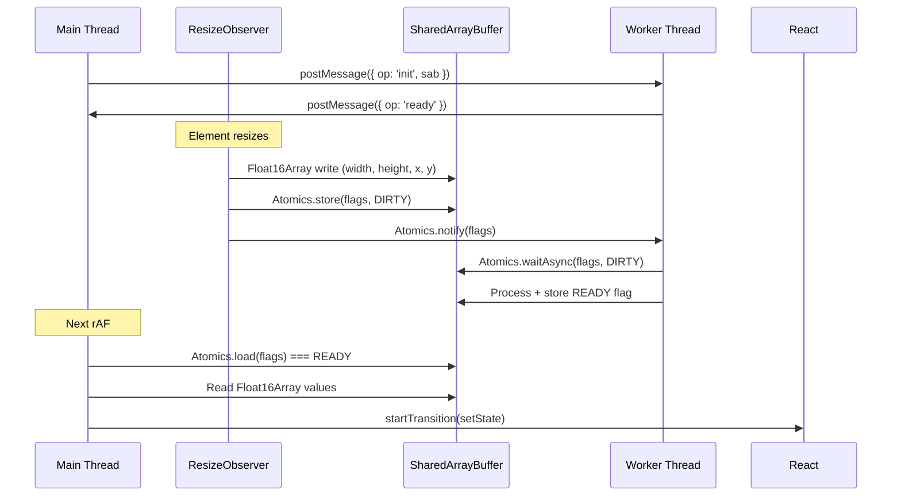
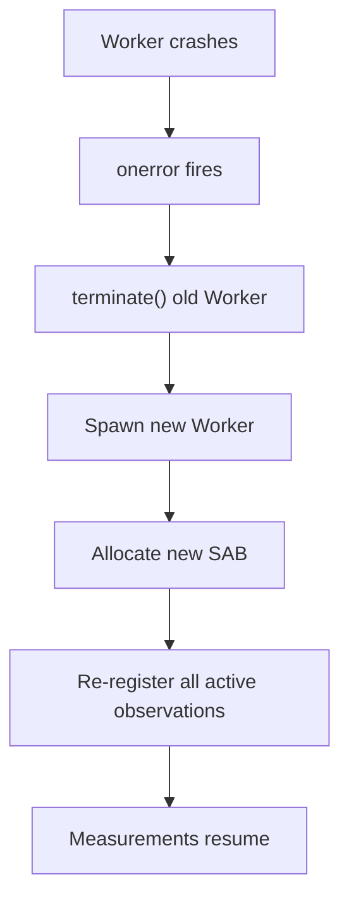

# Worker Mode

Move all ResizeObserver measurements off the main thread for jank-free UIs using `SharedArrayBuffer` and `Float16Array`.

## When to Use Worker Mode

Worker mode is beneficial when:

- You have **> 50 simultaneously resizing elements**
- Resize callbacks trigger **expensive computations** (layout calculations, canvas rendering)
- Your UI runs **animations during resize** (drag-and-drop, panel resizing)
- You need the **lowest possible input latency**

::: tip Decision Rule
If your app has fewer than 50 observed elements and no animation during resize, the main-thread hook is sufficient and simpler.
:::

## Quick Start

```tsx
import { useResizeObserver } from '@crimson_dev/use-resize-observer';
import { createWorkerObserver } from '@crimson_dev/use-resize-observer/worker';

// Create once at module level
const workerObserver = createWorkerObserver({
  maxElements: 256,
  precision: 'float16',
});

const MyComponent = () => {
  const { ref, width, height } = useResizeObserver<HTMLDivElement>({
    observer: workerObserver,
  });

  return <div ref={ref}>{width} x {height}</div>;
};
```

## Requirements

Worker mode requires `crossOriginIsolated === true`, which means your server must send these headers:

```
Cross-Origin-Opener-Policy: same-origin
Cross-Origin-Embedder-Policy: require-corp
```

### Server Configuration Examples

**Vite dev server:**

```typescript
// vite.config.ts
export default defineConfig({
  server: {
    headers: {
      'Cross-Origin-Opener-Policy': 'same-origin',
      'Cross-Origin-Embedder-Policy': 'require-corp',
    },
  },
});
```

**Next.js:**

```typescript
// next.config.ts
const nextConfig = {
  async headers() {
    return [
      {
        source: '/(.*)',
        headers: [
          { key: 'Cross-Origin-Opener-Policy', value: 'same-origin' },
          { key: 'Cross-Origin-Embedder-Policy', value: 'require-corp' },
        ],
      },
    ];
  },
};
export default nextConfig;
```

**Nginx:**

```nginx
add_header Cross-Origin-Opener-Policy same-origin;
add_header Cross-Origin-Embedder-Policy require-corp;
```

**Vercel (`vercel.json`):**

```json
{
  "headers": [
    {
      "source": "/(.*)",
      "headers": [
        { "key": "Cross-Origin-Opener-Policy", "value": "same-origin" },
        { "key": "Cross-Origin-Embedder-Policy", "value": "require-corp" }
      ]
    }
  ]
}
```

**Cloudflare Workers:**

```typescript
export default {
  async fetch(request: Request): Promise<Response> {
    const response = await fetch(request);
    const newHeaders = new Headers(response.headers);
    newHeaders.set('Cross-Origin-Opener-Policy', 'same-origin');
    newHeaders.set('Cross-Origin-Embedder-Policy', 'require-corp');
    return new Response(response.body, { ...response, headers: newHeaders });
  },
};
```

::: warning COEP and third-party resources
`Cross-Origin-Embedder-Policy: require-corp` blocks loading of cross-origin resources (images, scripts, iframes) that don't explicitly opt in via `Cross-Origin-Resource-Policy: cross-origin`. If your page loads third-party content, you may need `credentialless` instead of `require-corp` (Chrome 96+).
:::

## How It Works



### SharedArrayBuffer Layout

Each observed element occupies a fixed-size slot in the buffer:

| Offset | Size | Field | Type |
|--------|------|-------|------|
| 0 | 2B | `inlineSize` (contentBox) | Float16 |
| 2 | 2B | `blockSize` (contentBox) | Float16 |
| 4 | 2B | `inlineSize` (borderBox) | Float16 |
| 6 | 2B | `blockSize` (borderBox) | Float16 |
| 8 | 4B | flags | Int32 (for Atomics) |

Each slot is 12 bytes. With `maxElements: 256`, the total buffer is 3,072 bytes (3KB).

### Flag States

| Value | State | Meaning |
|-------|-------|---------|
| 0 | `IDLE` | No pending measurement |
| 1 | `DIRTY` | Main thread wrote new data, worker has not processed |
| 2 | `READY` | Worker processed, main thread can read |

### Float16Array

Worker mode uses `Float16Array` (ES2026) for compact measurement storage:

- 3 decimal digits of precision (sufficient for CSS pixel measurements)
- Half the memory footprint of `Float32Array`
- Range of +/- 65,504 (covers any realistic element dimension)

::: warning Float16 precision limits
Float16 has limited precision for very large values. Elements wider than 2,048 CSS pixels will lose sub-pixel accuracy. For full-screen canvas at 4K resolution, use `precision: 'float32'` instead.
:::

## Worker Pooling

All hook instances using the same `workerObserver` share a **single Worker instance**:

```
100 components with useResizeObserver({ observer: workerObserver })
  --> 1 Worker
  --> 1 SharedArrayBuffer
  --> 1 ResizeObserver
```

The Worker is:

- **Lazy-initialized** on first `observe()` call
- **Kept alive** as long as at least one element is observed
- **Auto-terminated** when the last element is unobserved

## Error Handling and Recovery

If the Worker crashes, it automatically recovers within 2 rAF cycles:

1. Worker error detected via `onerror` handler
2. Old Worker terminated
3. New Worker spawned with fresh SharedArrayBuffer
4. All active observations re-registered
5. Measurements resume seamlessly



::: danger crossOriginIsolated Required
If `crossOriginIsolated` is `false`, `createWorkerObserver` throws a descriptive error in development mode with a link to MDN documentation. In production, it falls back silently to main-thread observation and emits a console warning.
:::

## Fallback Behavior

If `SharedArrayBuffer` is not available (missing headers, older browser, or non-secure context), the worker observer automatically falls back to main-thread mode:

```tsx
const workerObserver = createWorkerObserver({ maxElements: 256 });
// If SAB is unavailable:
//   - Development: throws with instructions
//   - Production: falls back to main-thread mode with console.warn
```

## Performance Comparison

| Metric | Main Thread | Worker Mode |
|--------|------------|-------------|
| Measurement latency | < 1ms | 16-33ms (1-2 frames) |
| Main thread work per resize | ~0.05ms | ~0.01ms (SAB read only) |
| Memory per element | ~64B | ~76B + 12B SAB slot |
| Maximum elements | Unlimited | `maxElements` config |
| Jank during heavy resize | Possible | Eliminated |

## Full Example: Animated Grid

```tsx
import { useResizeObserver } from '@crimson_dev/use-resize-observer';
import { createWorkerObserver } from '@crimson_dev/use-resize-observer/worker';

const workerObserver = createWorkerObserver({
  maxElements: 512,
  precision: 'float16',
});

const AnimatedGrid = () => {
  const items = Array.from({ length: 100 }, (_, i) => i);

  return (
    <div style={{ display: 'grid', gridTemplateColumns: 'repeat(auto-fill, minmax(100px, 1fr))' }}>
      {items.map((i) => (
        <GridItem key={i} />
      ))}
    </div>
  );
};

const GridItem = () => {
  const { ref, width, height } = useResizeObserver<HTMLDivElement>({
    observer: workerObserver,
  });

  return (
    <div
      ref={ref}
      style={{
        aspectRatio: '1',
        background: `oklch(${30 + (width ?? 0) / 20}% 0.15 ${(width ?? 0) % 360})`,
        transition: 'background 0.1s',
        display: 'grid',
        placeItems: 'center',
      }}
    >
      {width !== undefined ? `${Math.round(width)}px` : '...'}
    </div>
  );
};
```

## Cleanup

Dispose the worker observer when it is no longer needed:

```tsx
// Using explicit resource management (ES2026)
{
  using observer = createWorkerObserver({ maxElements: 256 });
  // observer[Symbol.dispose]() called automatically at end of block
}

// Or manual disposal
const observer = createWorkerObserver({ maxElements: 256 });
// ... later ...
observer.dispose();
```

## Next Steps

- [Architecture](/guide/architecture) -- How the pool integrates worker and main-thread modes
- [Performance](/guide/performance) -- Benchmark data for worker vs main-thread mode
- [SSR & RSC](/guide/ssr) -- Worker mode behavior during server rendering
